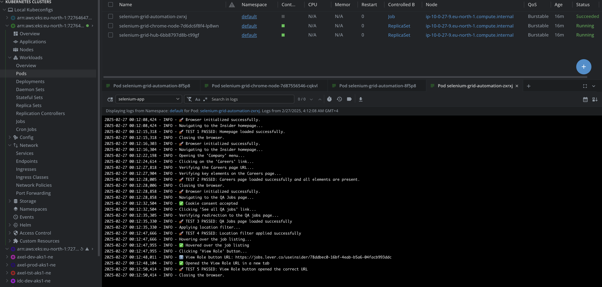

# AutomationQA

# QA Automation Project with Selenium and CI/CD Pipeline

This project is a Python-based QA automation framework that uses **Selenium** to perform end-to-end testing on the [Insider](https://useinsider.com/) website. It includes automated tests for verifying the homepage, careers page, and QA jobs functionality. The project is integrated with a **CI/CD pipeline** using GitHub Actions, Docker, and Helm for deployment to an **Amazon EKS** cluster.

---
## 🚀 Features
- **Automated Tests**:
  - Verify the homepage loads correctly.
  - Validate the Careers page and its key elements.
  - Test the QA Jobs page, including location filtering and job role redirection.
- **CI/CD Pipeline**:
  - Linting and dependency installation.
  - Docker image building and publishing to **Amazon ECR**.
  - Helm chart deployment to **Amazon EKS**.
- **Selenium Grid**:
  - Uses a Selenium Grid setup with a Hub and Chrome Node for distributed testing.
---
## 🛠️ Technologies Used
- **Python**: Core programming language for writing automation scripts.
- **Selenium**: Browser automation framework.
- **Docker**: Containerization for Selenium Hub, Chrome Node, and test scripts.
- **Helm**: Kubernetes package manager for deploying Selenium Grid.
- **Amazon EKS**: Managed Kubernetes service for running the Selenium Grid.
- **GitHub Actions**: CI/CD pipeline automation.
- **AWS ECR**: Docker image repository for storing container images.
---
## � Tests Overview
### 1. **Homepage Verification**
   - Navigates to the Insider homepage.
   - Verifies the page title contains "Insider".
### 2. **Careers Page Verification**
   - Navigates to the Careers page via the Company menu.
   - Verifies the URL and key elements like "Our Locations" and "Life at Insider".
### 3. **QA Jobs Page Verification**
   - Navigates to the QA Jobs page.
   - Applies a location filter (e.g., Istanbul, Turkiye).
   - Clicks the "View Role" button and verifies redirection to the job details page.
---

## 🚀 CI/CD Pipeline
The CI/CD pipeline is configured using GitHub Actions and includes the following steps:
1. **Verify Application**:
   - Checks out the code.
   - Sets up Python and installs dependencies.
   - Runs `pylint` for code linting.
2. **Build and Publish Docker Images**:
   - Builds Docker images for the test scripts, Selenium Hub, and Chrome Node.
   - Publishes the images to **Amazon ECR**.
3. **Deploy Helm Chart**:
   - Installs `kubectl` and `Helm`.
   - Configures AWS credentials and updates the kubeconfig for the EKS cluster.
   - Verifies and deploys the Helm chart for the Selenium Grid.
---
# QA Automation Project with Selenium Grid on EKS

This project automates end-to-end testing for the [Insider](https://useinsider.com/) website using **Selenium Grid** deployed on **Amazon EKS**. The tests are executed in a distributed manner, where a **Job Pod** sends test requests to the **Selenium Hub**, which delegates the tasks to a **Chrome Node Pod** for execution. The entire system is deployed using a **Helm chart**.
---
## 🚀 How It Works

1. **Job Pod**: Runs the test scripts (`main.py`) and sends test requests to the Selenium Hub.
2. **Selenium Hub**: Acts as a central point that receives test requests and delegates them to the appropriate browser node.
3. **Chrome Node Pod**: Executes the test tasks in a Chrome browser and returns the results.

### System Flow Diagram

+-------------------+       +-------------------+       +-------------------+
|                   |       |                   |       |                   |
|    Job Pod        | ----> |  Selenium Hub     | ----> |  Chrome Node Pod  |
|(python code pod)  |       |  (Controller)     |       |  (Executes Tests) |
|                   |       |                   |       |                   |
+-------------------+       +-------------------+       +-------------------+

### Expected Output

1.This project does XYZ. Below is a representation of the architecture:

